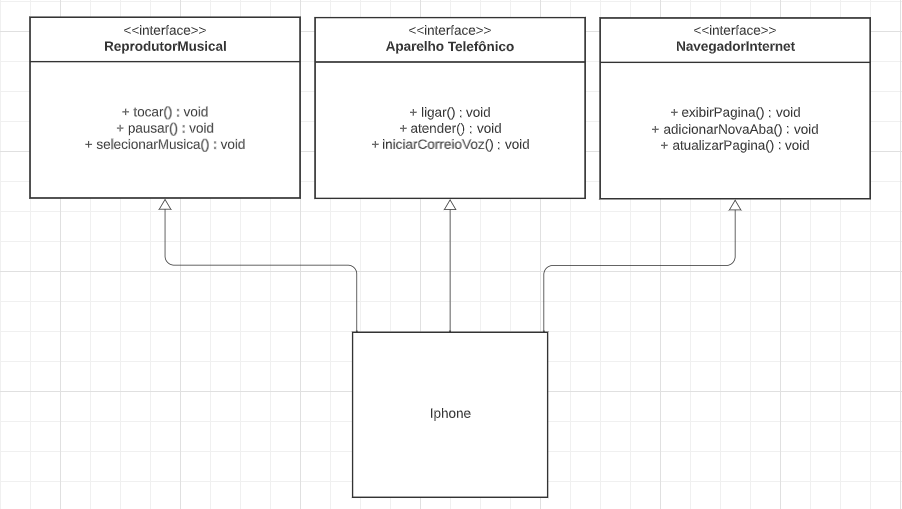

## 📱 Desafio de Projeto: Modelando o iPhone com UML - Funções de Músicas, Chamadas e Internet
### 📜 Descrição:
Este `Desafio de Projeto` foi proposto pela `DIO - Digital Innovation One` inicialmente em `Santander Bootcamp 2023 - Backend Java` e posteriormente no `Bootcamp Claro - Java com Spring Boot`.

Este Projeto tem o objetivo de colocar em prática a concepção de análise de negócios, requisitos, conceitos da programação orientada a objetos e modelagem UML. Foi utilizado como base o vídeo de lançamento do iPhone para elaborar em uma ferramenta de UML a diagramação das classes e interfaces com a proposta de representar os papéis do iPhone de: Reprodutor Musical, Aparelho Telefônico e Navegador na Internet e em seguida criando as classes e interfaces na linguagem `Java`.

### ⏯ Como utilizar:

Este projeto não foi implementado para ser executado e sim somente para exemplificar como funciona a herança multipla trabalhando com interfaces distintas.

No diretório `src` está localizada a classe `Iphone.java` que implementa as interfaces `ReprodutorMusical.java`, `AparelhoTelefonico.java`, `NavegadorInternet.java` e seus respectivos métodos, como podemos notar também no diagrama UML a seguir.

### 🎲 Diagrama UML

### 🛠 Tecnologias utilizadas:

    
    
        

### 📫 Entre em contato comigo:

     
  
  

### 🤝 Contribua:
Sinta-se a vontade para somar com a sua contribuição, basta dar um `fork`.

⭐️ Dê um `star` no projeto.

🐛 Abra uma `issues` para relatar algum problema.
